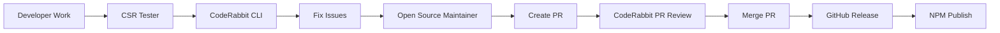

# Claude Self-Reflect - Action Guide

## ⚠️ BREAKING CHANGES (v3.x → v4.0)

### Critical Migration Required
**⚠️ STOP**: If upgrading from v3.x, read this first!

#### Hash Algorithm Migration
- **Old**: MD5 IDs (legacy support enabled)
- **New**: SHA-256 + UUID for new conversations
- **Action**: Run `python scripts/migrate-ids.py` after backup

#### Embedding Dimensions
- **Local**: 384 dimensions (FastEmbed)
- **Cloud**: 1024 dimensions (Voyage)
- **Warning**: Collections are NOT cross-compatible
- **Action**: Rebuild collections if switching modes

#### Authentication Changes
- **New**: Qdrant requires authentication
- **Action**: Update `.env`: `QDRANT_API_KEY="your-key"`
- **Deadline**: Old connections fail after 2025-12-01

#### Async Pattern Changes
- **Old**: Threading-based operations
- **New**: Full asyncio implementation
- **Action**: Update custom scripts using the API

#### Collection Naming
- **Old**: Simple project names
- **New**: Prefixed naming
  - Local mode: `csr_project_local_384d` (384 dimensions)
  - Cloud mode: `csr_project_cloud_1024d` (1024 dimensions)
- **Action**: Run `python scripts/migrate-collections.py`

### Migration Checklist (v4.x → v5.0 with Unified State)
- [ ] Backup Qdrant data: `python scripts/backup-qdrant.py`
- [ ] Run ID migration: `python scripts/migrate-ids.py`
- [ ] Update collection names: `python scripts/migrate-collections.py`
- [ ] Add authentication: `python scripts/migrate-auth.py`
- [ ] Migrate to unified state: `python scripts/migrate-unified-state.py --dry-run` then without flag
- [ ] Test search functionality
- [ ] Verify all agents working

## 🎯 Primary Actions (Use These Daily)

### Search Past Conversations
```python
# Primary search tool - use liberally!
reflect_on_past("docker compose issues")

# Quick existence check
quick_search("have we discussed authentication?")

# Get insights without details
search_summary("performance optimization patterns")
```

### Check System Health
```bash
# Is everything working?
python mcp-server/src/status.py  # Real import status
docker ps | grep qdrant          # Vector DB running?
```

### Import New Conversations
```bash
source venv/bin/activate
python scripts/import-conversations-unified.py --limit 5  # Test first
python scripts/import-conversations-unified.py           # Full import
```

## 🚀 v7.0 AI-Powered Narratives (NEW!)

### What It Is
Transform raw conversations into rich, searchable narratives with **9.3x better search quality**.

### Key Benefits
- 📊 **9.3x improvement**: Search scores jump from 0.074 to 0.691
- 💰 **50% cost savings**: $0.012/conversation via Anthropic Batch API
- 🗜️ **82% token compression**: Maintains searchability with less storage
- 🔍 **Rich metadata**: Auto-extract tools, concepts, files from conversations

### Files Involved

**Core Scripts:**
- `docs/design/batch_import_all_projects.py` - Main narrative generator
- `docs/design/batch_ground_truth_generator.py` - Evaluation dataset creator
- `docs/design/extract_events_v3.py` - V3 extraction with metadata
- `docs/design/conversation-analyzer/SKILL_V2.md` - Narrative template

**Runtime Services:**
- `src/runtime/batch_watcher.py` - Monitors for new conversations
- `src/runtime/batch_monitor.py` - Polls Batch API for results
- `Dockerfile.batch-watcher` - Watcher container
- `Dockerfile.batch-monitor` - Monitor container

**Configuration:**
- `docker-compose.yaml` - Profile: `batch-automation` (disabled by default)
- `.env` - Requires: `ANTHROPIC_API_KEY=sk-ant-...`

### CLI Installation Experience
During `claude-self-reflect setup`, users are prompted:

```
🚀 AI-Powered Narratives (NEW in v7.0!)
━━━━━━━━━━━━━━━━━━━━━━━━━━━━━━━━━━━━━━━
Transform your conversations into rich, searchable narratives.

📊 Benefits:
   • 9.3x better search quality (0.074 → 0.691 relevance score)
   • 82% token compression while maintaining searchability
   • 50% cost savings using Anthropic Batch API (~$0.012/conversation)
   • Automatic extraction: tools used, files modified, concepts

Enable AI-powered narratives? (y/n) [recommended for best search]:
```

If YES → Prompts for `ANTHROPIC_API_KEY` and starts batch services automatically.

### Manual Enable (After Installation)
```bash
# 1. Add API key to .env
echo "ANTHROPIC_API_KEY=sk-ant-..." >> .env

# 2. Start batch automation services
docker compose --profile batch-automation up -d

# 3. Monitor progress
docker compose logs batch-watcher -f   # Watch for queued conversations
docker compose logs batch-monitor -f   # Watch batch processing
```

### How It Works (Automatic)
1. `batch-watcher` monitors `~/.claude/projects/` for new conversations
2. When 10+ conversations accumulate → triggers batch job
3. `batch-monitor` polls Anthropic Batch API for results
4. Completed narratives auto-imported to Qdrant
5. Search automatically uses enhanced narratives

### What Users See

**BEFORE (Raw Excerpts):**
```
User: How do I fix the Docker memory issue?
Assistant: The container was limited to 2GB...
[Search score: 0.074]
```

**AFTER (AI Narratives):**
```
PROBLEM: Docker container memory investigation...
SOLUTION: Implemented proper resource constraints...
TOOLS: Docker, grep, Edit
CONCEPTS: container-memory, resource-limits
FILES: docker-compose.yaml, batch_watcher.py
[Search score: 0.691]
```

### Agent Reference
When users ask about "narratives", "v7.0 feature", "batch automation", or "search quality":
- ✅ Feature is **opt-in** (requires ANTHROPIC_API_KEY)
- ✅ Fully automated once enabled
- ✅ CLI now prompts during installation (as of this commit)
- ✅ 9.3x improvement is real (measured via evaluation dataset)
- ✅ Privacy: Conversations sent to Anthropic (user must consent)

## 🧪 Session Health Check (Automatic)

### Quick Evaluation at Session Start

If enabled, claude-self-reflect runs a lightweight health check on startup to ensure MCP tools, search quality, and performance are functioning correctly.

**Enable in .env**:
```bash
EVAL_ON_STARTUP=true
```

**What It Checks** (5 tests, <30s):
- ✅ Qdrant connectivity
- ✅ Search accuracy (single quick query)
- ✅ Performance target (<500ms searches)
- ✅ Token efficiency (brief mode)
- ✅ Tool availability (all MCP tools)

**Startup Banner Example**:
```
━━━━━━━━━━━━━━━━━━━━━━━━━━━━━━━━━━━━━━━━━━━━━━━
🧪 Claude Self-Reflect Health Check
━━━━━━━━━━━━━━━━━━━━━━━━━━━━━━━━━━━━━━━━━━━━━━━
✅ Qdrant Connection      (12ms)
✅ Search Accuracy         (245ms, score: 0.68)
✅ Performance Target      (avg: 234ms, p95: 450ms)
✅ Token Efficiency        (52% reduction in brief mode)
✅ Tool Availability       (15/15 tools responding)

📊 Overall: HEALTHY (5/5 passed)
⏱️  Total time: 1.2s
━━━━━━━━━━━━━━━━━━━━━━━━━━━━━━━━━━━━━━━━━━━━━━━
```

### Manual Evaluation Commands

**Quick check** (5 tests, <30s):
```bash
python scripts/evaluation/session_start_eval.py --quick
```

**Full evaluation** (20 tests, ~2 minutes):
```bash
python scripts/evaluation/session_start_eval.py
```

**JSON output** (for scripting):
```bash
python scripts/evaluation/session_start_eval.py --quick --json
```

### Evaluation Task Categories

The system tests 20 real-world scenarios across 6 categories:
- **Semantic search** (5 tasks) - Find relevant conversations accurately
- **Temporal search** (3 tasks) - Time-constrained queries ("last week")
- **File-based search** (3 tasks) - Track file modifications
- **Concept search** (3 tasks) - Theme-based discovery
- **Tool selection** (3 tasks) - Use correct tool for each task
- **Token efficiency** (3 tasks) - Brief mode effectiveness

### Troubleshooting

**"Qdrant Connection Failed"**:
```bash
docker ps | grep qdrant  # Is Qdrant running?
docker compose up -d qdrant
```

**"Search Accuracy Below Threshold"**:
- Check if collections exist: `python mcp-server/src/status.py`
- Verify embeddings are current
- Run full import if needed

**"Performance Degraded"**:
- Check Qdrant resource usage: `docker stats qdrant`
- Clear old collections if disk full
- Consider increasing Docker memory limits

### Configuration Options

Add to `.env`:
```bash
# Evaluation Settings
EVAL_ON_STARTUP=false           # Enable session-start evals (opt-in)
EVAL_TIMEOUT_SECONDS=30         # Max time for eval run
EVAL_PERFORMANCE_TARGET_MS=500  # Target latency for searches
```

**Files**:
- Golden query corpus: `scripts/evaluation/evaluation_tasks.json`
- Session-start script: `scripts/evaluation/session_start_eval.py`
- Full evaluator: `scripts/evaluation/run_evaluation.py`
- Ground truth generator: `docs/design/batch_ground_truth_generator.py`

## ⚠️ Critical Rules

1. **PATH RULE**: Always use `/Users/username/...` never `~/...` in MCP commands
2. **TEST RULE**: Never claim success without running tests
3. **IMPORT RULE**: If status.py shows imports working, trust it (not other indicators)
4. **RESTART RULE**: After modifying MCP server code, restart Claude Code entirely
5. **QUALITY GATE RULE**: When quality gate blocks commit, FIX THE GATE (add safe patterns), NEVER use `--no-verify`

## 🛡️ Quality Gate Best Practices

### When Quality Gate Blocks Your Commit

**❌ WRONG: Bypass the gate**
```bash
git commit --no-verify  # NEVER DO THIS
```

**✅ RIGHT: Fix the gate to recognize safe patterns**
```bash
# 1. Understand WHY it blocked
#    - Is this actually unsafe? Fix the code
#    - Is this a false positive? Update the gate

# 2. For false positives, update quality-gate-staged.py:
#    Edit CRITICAL_PATTERNS to be more specific
#    Example: Change 'subprocess.run(' to 'subprocess.run(shell=True'

# 3. Test the fix
python scripts/quality-gate-staged.py

# 4. Commit the gate improvement with the original changes
git add scripts/quality-gate-staged.py
git commit -m "fix: quality gate + original changes"
```

### Safe vs Unsafe Patterns

**Safe subprocess usage (ALLOWED):**
```python
subprocess.run(['npm', 'pack', '--dry-run'], capture_output=True)  # ✅ List-based, no shell
subprocess.run(['docker', 'build', '-t', tag], check=True)          # ✅ Safe
```

**Unsafe subprocess usage (BLOCKED):**
```python
subprocess.run(f'rm -rf {user_input}', shell=True)  # ❌ Shell injection risk
subprocess.Popen(cmd, shell=True)                   # ❌ Dangerous
```

### Quality Gate Files
- `scripts/quality-gate-staged.py` - Main gate logic
- `.git/hooks/pre-commit` - Git hook that runs the gate
- When updating these, run through codex evaluator for review

## 🔧 One-Time Setup

### Add MCP to Claude Code
```bash
# CRITICAL: Replace YOUR_USERNAME with actual username
claude mcp add claude-self-reflect \
  "/Users/YOUR_USERNAME/projects/claude-self-reflect/mcp-server/run-mcp.sh" \
  -e QDRANT_URL="http://localhost:6333" \
  -e QDRANT_API_KEY="your-key-if-auth-enabled" \
  -s user
```

### Start Required Services
```bash
docker compose up -d qdrant  # Vector database
docker start claude-reflection-safe-watcher  # Auto-importer
```

## 🚨 Troubleshooting Matrix

| Symptom | Check | Fix |
|---------|-------|-----|
| No search results | `docker ps \| grep qdrant` | `docker compose up -d qdrant` |
| Tools not available | `claude mcp list` | Remove & re-add MCP, restart Claude |
| Import shows 0% | Test with `reflect_on_past` | If search works, ignore the 0% |
| "spawn ~ ENOENT" | Check MCP path has `~` | Use full path `/Users/...` |

## 📁 Key Files

| What | Where | Purpose |
|------|-------|---------|
| Conversations | `~/.claude/projects/*/` | Source JSONL files |
| Unified state | `~/.claude-self-reflect/config/unified-state.json` | Single source of truth (v5.0) |
| State manager | `scripts/unified_state_manager.py` | Unified state management |
| MCP server | `mcp-server/src/server.py` | Main server (728 lines) |

## 🤖 Agent Activation Keywords

Say these to auto-activate specialized agents:
- "import showing 0 messages" → import-debugger
- "search seems irrelevant" → search-optimizer
- "find conversations about X" → reflection-specialist
- "Qdrant collection issues" → qdrant-specialist
- "quality issues detected" → quality-fixer
- "docker services fail" → docker-orchestrator
- "MCP tools not working" → mcp-integration
- "performance issues" → performance-tuner
- "test installations" → reflect-tester
- "release management" → open-source-maintainer

## Ralph Loop Memory Integration

### What It Is
The Ralph Wiggum technique helps Claude maintain context across long coding sessions through structured markdown files. With CSR integration, Ralph loops gain **cross-session memory**-state is preserved across context compactions and retrievable in future sessions.

### Key Benefits
- **Cross-session memory**: Retrieve insights from past Ralph sessions
- **Pre-compaction backup**: State automatically saved to CSR before context compaction
- **Pattern retrieval**: Search for similar past challenges and solutions
- **Session narratives**: Complete session summaries stored for future reference

### v7.1+ Enhanced Features (Verified 2026-01-04)
- **Error Signature Deduplication**: Normalizes errors (removes line numbers, paths, timestamps)
- **Output Decline Detection**: Circuit breaker pattern (detects >70% output drop)
- **Confidence-Based Exit**: 0-100 scoring for exit decisions
- **Anti-Pattern Injection**: "DON'T RETRY THESE" surfaced first
- **Work Type Tracking**: IMPLEMENTATION/TESTING/DEBUGGING/DOCUMENTATION
- **Error-Centric Search**: Find past sessions by error pattern, not just task

### How It Works

1. **SessionStart Hook**: When a new Ralph session begins, CSR is searched for:
   - Past sessions with similar tasks
   - **Similar errors** (error-centric search)
   - **Anti-patterns** (failed approaches from incomplete sessions)
   - **Winning strategies** (successful session patterns)

2. **PreCompact Hook**: Before context compaction destroys the session:
   - Current Ralph state is backed up to CSR
   - Iteration count, learnings, and approaches are preserved

3. **SessionEnd Hook**: When session completes:
   - Full narrative is stored to CSR with rich metadata
   - Tagged for future searchability
   - Winning strategies stored separately for successful sessions

### Verified Proof
```
# Session start hook output (2026-01-04T10:36:30):
INFO: Found 2 relevant results:
  - Anti-patterns: 0
  - Winning strategies: 0
  - Error matches: 0
  - Similar tasks: 2

# Qdrant storage (actual data):
{
  "tags": ["ralph_session", "outcome_completed", "iterations_8"],
  "timestamp": "2026-01-04T18:13:03.711262+00:00"
}

# RalphState features verified:
- Error dedup: 3 errors -> 2 signatures (same file deduped)
- Output decline: [1000,950,900,200,100,50] -> Declining: True
- Confidence: tasks+tests+no_errors = 80%
```

### Installation

```bash
# Install Ralph hooks (also prompted during setup)
./scripts/ralph/install_hooks.sh

# Verify installation
./scripts/ralph/install_hooks.sh --check

# Remove hooks
./scripts/ralph/install_hooks.sh --remove
```

### Usage

```bash
# Start a Ralph loop (plugin handles state file creation)
/ralph-wiggum:ralph-loop

# CSR integration is automatic:
# - Past insights injected at session start
# - State backed up before compaction
# - Narrative stored at session end
```

### Files

| What | Where | Purpose |
|------|-------|---------|
| Ralph state (plugin) | `.claude/ralph-loop.local.md` | ralph-wiggum plugin state |
| Ralph state (custom) | `.ralph_state.md` | Custom state file |
| State module | `src/runtime/hooks/ralph_state.py` | State parsing & management |
| SessionStart hook | `src/runtime/hooks/session_start_hook.py` | Search CSR for past sessions |
| SessionEnd hook | `src/runtime/hooks/session_end_hook.py` | Store session narrative |
| PreCompact hook | `src/runtime/precompact-hook.sh` | Backup state before compaction |
| Standalone client | `mcp-server/src/standalone_client.py` | CSR client for hooks |
| Tests | `tests/ralph/test_ralph_integration.py` | Integration tests |
| Iteration hook | `src/runtime/hooks/iteration_hook.py` | Iteration-level memory (v7.1.9) |

### Ralph Loop Iteration Protocol (v7.1.9)

When running in a Ralph loop, follow this protocol for iteration-level memory:

1. **At iteration START**: Read `.ralph_state.md` if it exists
   ```bash
   cat .ralph_state.md
   ```

2. **Before trying any approach**: Check "DO NOT RETRY" list in state file

3. **After each significant action**: Update `.ralph_state.md`:
   - Add failed approaches to `## Failed Approaches`
   - Add successful patterns to `## Successful Strategies`
   - Add blocking errors to `## Blocking Errors`

4. **Before iteration ends**: Ensure state file is updated with learnings

**Programmatic usage**:
```bash
# Get context for next iteration
python src/runtime/hooks/iteration_hook.py

# Persist a learning
python src/runtime/hooks/iteration_hook.py --persist \
  "approach description" "FAILURE|SUCCESS|PARTIAL" "error msg" "learning"
```

### Stopping Ralph Loops

**CRITICAL**: The ralph-wiggum plugin only stops when:
1. **File is DELETED** (not just `active: false`)
2. **max_iterations reached** (if set)
3. **Completion promise detected** in `<promise>` tags

**To stop a runaway loop**:
```bash
# Method 1: Delete the state file (RECOMMENDED)
rm .claude/ralph-loop.local.md

# Method 2: Use the cancel skill
/ralph-wiggum:cancel-ralph

# Method 3: Output completion promise
<promise>YOUR_PROMISE_TEXT</promise>
```

**WARNING**: Setting `active: false` does NOT stop the loop!
The plugin's stop-hook only checks if the file EXISTS, not the active flag.
Our `is_ralph_session()` checks `active: false`, but the plugin doesn't.

**ALWAYS use `--max-iterations` as a safety net**:
```bash
# Correct (note: plural 'iterations')
/ralph-loop "task" --max-iterations 50

# WRONG (singular - will be ignored, loop runs forever)
/ralph-loop "task" --max-iteration 50
```

### Troubleshooting

**"Loop won't stop / Runaway loop"**:
```bash
# Delete the state file - this is the ONLY reliable way
rm .claude/ralph-loop.local.md

# Setting active: false does NOT work - plugin ignores it
```

**"Hooks not triggering"**:
```bash
# Verify hooks are installed
./scripts/ralph/install_hooks.sh --check

# Check settings.json for hook configuration
cat ~/.claude/settings.json | grep -A5 ralph
```

**"CSR connection failed in hooks"**:
```bash
# Verify Qdrant is running
docker ps | grep qdrant

# Test standalone client
python -c "from mcp_server.src.standalone_client import CSRStandaloneClient; c = CSRStandaloneClient(); print(c.test_connection())"
```

**"State not being backed up"**:
```bash
# Check if ralph state file exists
ls -la .claude/ralph-loop.local.md .ralph_state.md 2>/dev/null

# Test precompact hook manually
./src/runtime/precompact-hook.sh
```

### Agent Reference
When users ask about "Ralph loop", "memory-augmented Ralph", or "cross-session context":
- ✅ Feature requires hook installation (`./scripts/ralph/install_hooks.sh`)
- ✅ Works with ralph-wiggum plugin (`.claude/ralph-loop.local.md`)
- ✅ Also works with custom state files (`.ralph_state.md`)
- ✅ Automatic backup before context compaction
- ✅ Past session search at new session start

## 🔧 Quality Automation

### AST-GREP Integration
The system now includes comprehensive AST-GREP pattern analysis:
- **Unified Registry**: 100+ patterns for Python/TypeScript
- **Auto-fix**: Safe pattern fixes applied automatically
- **Quality Gates**: Pre-commit and post-generation hooks
- **Command**: `/fix-quality` to run quality fixer

### Hooks System
Automated hooks for quality control:
```bash
# Pre-commit: Updates quality cache
.claude/hooks/pre-commit

# Post-generation: Tracks edits and runs analysis
.claude/hooks/post-generation
```

### Quality Commands
```bash
# Run quality analysis
python scripts/ast_grep_final_analyzer.py

# Apply safe fixes
python scripts/ast_grep_final_analyzer.py --fix

# Check quality gate
python scripts/quality-gate.py --threshold 10

# Session quality tracking
python scripts/session_quality_tracker.py
```

## 🔄 Unified State Management (v5.0)

### Migration to Unified State
```bash
# Run migration (backs up old files automatically)
python scripts/migrate-to-unified-state.py

# Preview changes without applying
python scripts/migrate-to-unified-state.py --dry-run

# Rollback if needed
python scripts/migrate-to-unified-state.py --rollback
```

### Benefits
- **50% faster** status checks (1.2ms for 1000 files)
- **50% less storage** (automatic deduplication)
- **Zero race conditions** (atomic operations with locking)
- **Single source of truth** (one JSON file instead of 5+)

## Mode Switching (Runtime, No Restart!)
```python
# Switch embedding modes without restarting
switch_embedding_mode(mode="cloud")  # Voyage AI, better accuracy
switch_embedding_mode(mode="local")  # FastEmbed, privacy-first
get_embedding_mode()                 # Check current mode
```

## 🚀 Complete Development & Release Workflow

### The Full Pipeline: Code → Test → Review → Release → NPM



### 1. Development Phase
**WHO**: Developer (You)
**WHAT**: Write code, fix bugs, add features
**HOW**:
```bash
# Create feature branch
git checkout -b fix/issue-description

# Make changes
# ... coding ...

# Run local tests
python mcp-server/src/status.py
```

### 2. Testing Phase
**WHO**: CSR Tester Agent
**WHAT**: Validate system functionality
**HOW**: Automatically activated with "test installations" or manually run
```bash
# CSR Tester runs comprehensive validation
# - MCP tools testing
# - Security scans
# - Performance checks
# - CodeRabbit CLI analysis (if terminal compatible)
```

### 2.5. Pre-PR Quality Gates (REQUIRED)
**WHO**: Developer + AI Code Reviewers (CodeRabbit CLI + Codex)
**WHAT**: Local code review before PR creation
**WHY**: Catch issues early, reduce CI/CD review cycles, ensure architectural soundness
**HOW**:

```bash
# PARALLEL EXECUTION: Run both reviews simultaneously
# In Claude Code, use parallel tool execution:
# 1. Start CodeRabbit in background: coderabbit --prompt-only 2>&1 | tee /tmp/coderabbit.log &
# 2. Trigger codex-evaluator agent in parallel
# 3. Wait for both to complete, then review results

# Method 1: Manual parallel execution
coderabbit --prompt-only > /tmp/coderabbit.log 2>&1 &
CODERABBIT_PID=$!

# While CodeRabbit runs, trigger Codex evaluation:
# Say: "codex evaluate the changes in this branch"
# Or: "Need architectural review for Docker and npm changes"

# Wait for CodeRabbit to finish
wait $CODERABBIT_PID
cat /tmp/coderabbit.log

# Method 2: Claude Code parallel tool execution (RECOMMENDED)
# Claude can execute both tools in a single message:
# "Run coderabbit --prompt-only and codex evaluation in parallel"

# Review both outputs:
# - CodeRabbit: Code quality, security, best practices
# - Codex: Architecture, design patterns, cross-platform compatibility

# Fix all CRITICAL issues (must fix before release)
# Fix all HIGH severity issues (strongly recommended)
# Commit fixes: git commit -am "fix: address CodeRabbit + Codex reviews"

# Re-run CodeRabbit to verify fixes
coderabbit --prompt-only

# Ensure no critical/high issues remain before proceeding
```

**Quality Gates**:
- ✅ CodeRabbit CLI: No critical or high severity issues
- ✅ Codex Agent: Architectural review passes with no major concerns
- ✅ All CRITICAL issues fixed (even if not in your changes)
- ✅ All fixes committed and tested locally

**IMPORTANT**: If CodeRabbit or Codex find CRITICAL issues anywhere in the codebase (even in files you didn't modify), those issues MUST be fixed before release and documented in release notes.

### 3. Code Review Phase - CI/CD
**WHO**: CodeRabbit (Automated PR Review)
**WHAT**: Comprehensive PR review in CI/CD pipeline
**WHEN**: After PR creation, runs automatically on every push
**HOW**:
```bash
# Create PR after local quality gates pass
gh pr create --title "fix: description" --body "Fixes #issue"

# Monitor CI/CD CodeRabbit review
gh pr view [PR_NUMBER] --comments | grep -A 10 "coderabbitai"

# If new issues found in CI/CD review, fix them
git checkout fix/branch-name
# ... make fixes ...
git commit -am "fix: address CI/CD CodeRabbit review"
git push

# Repeat until CodeRabbit approves and all CI tests pass
```

**Quality Gates**:
- ✅ CodeRabbit CI/CD review: No blocking issues
- ✅ All CI/CD tests pass: python-test, npm-package-test, docker-build
- ✅ PR approved by maintainers

### 4. Release Management Phase
**WHO**: Open Source Maintainer Agent
**WHAT**: Merge PR, create release, publish to NPM
**WORKFLOW**:

```bash
# Step 1: Merge PR after all quality gates pass
gh pr merge [PR_NUMBER] --squash

# Step 2: Create GitHub Release
VERSION="v5.0.1"
gh release create $VERSION \
  --title "$VERSION - CodeRabbit Fixes" \
  --notes "Fixed issues identified by CodeRabbit"

# Step 3: Monitor NPM Publication (automated via CI/CD)
gh run watch  # Watch CI/CD publish to NPM

# Step 4: Verify NPM Package
npm view claude-self-reflect@latest version
```

### 5. Post-Release Phase
**WHO**: Open Source Maintainer Agent
**WHAT**: Close issues, update docs, announce
**HOW**:
```bash
# Close related issues
gh issue close [ISSUE_NUMBER] --comment "Fixed in $VERSION"

# Update documentation
# Announce in discussions
```

## 🔍 Code Review with CodeRabbit

### AI Agent Workflow (Recommended)
```bash
# For AI coding agents - optimized token-efficient output
coderabbit --prompt-only

# This creates a powerful workflow:
# 1. CodeRabbit identifies problems with full codebase context
# 2. AI agent (Claude) implements the fixes
# 3. Expert-level issue detection + AI-powered implementation
```

### Command Reference
```bash
# Interactive mode (default)
coderabbit

# Plain text detailed feedback
coderabbit --plain

# Minimal output for AI agents (BEST FOR CLAUDE)
coderabbit --prompt-only

# Short alias works too
cr --prompt-only
```

### Additional Options
```bash
# Review specific types
coderabbit --type all          # Review everything (default)
coderabbit --type committed    # Only committed changes
coderabbit --type uncommitted  # Only uncommitted changes

# Compare against base
coderabbit --base main                    # Compare to branch
coderabbit --base-commit HEAD~2          # Compare to commit

# Additional config
coderabbit --config claude.md coderabbit.yaml

# Disable colors
coderabbit --no-color
```

### GitHub PR Integration (Alternative)
```bash
# Check PR comments for CodeRabbit feedback
gh pr view [PR_NUMBER] --comments | grep -A 10 "coderabbitai"
```

**Note:** PR reviews and CLI reviews will differ - CLI optimizes for immediate development feedback, while PR reviews provide comprehensive team collaboration context.

---
*Architecture details, philosophy, and history → See `docs/`*
*Full command reference → See `docs/development/MCP_REFERENCE.md`*
