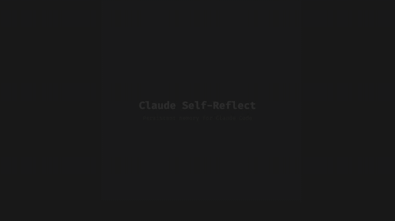
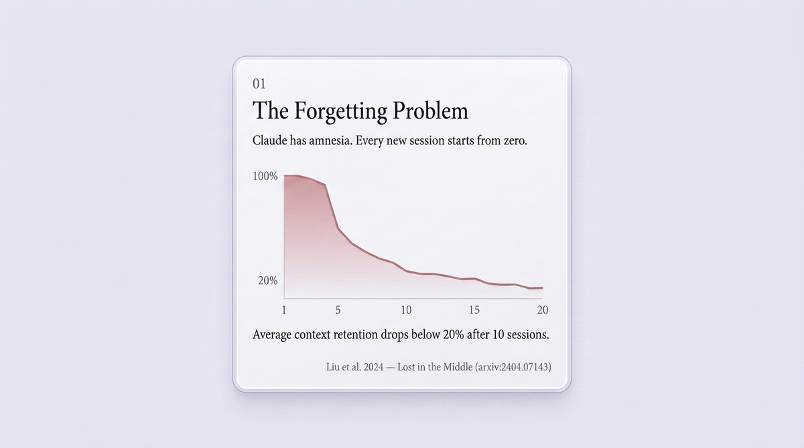
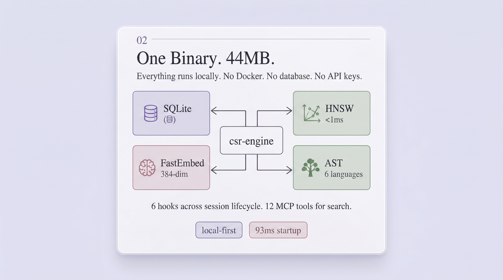
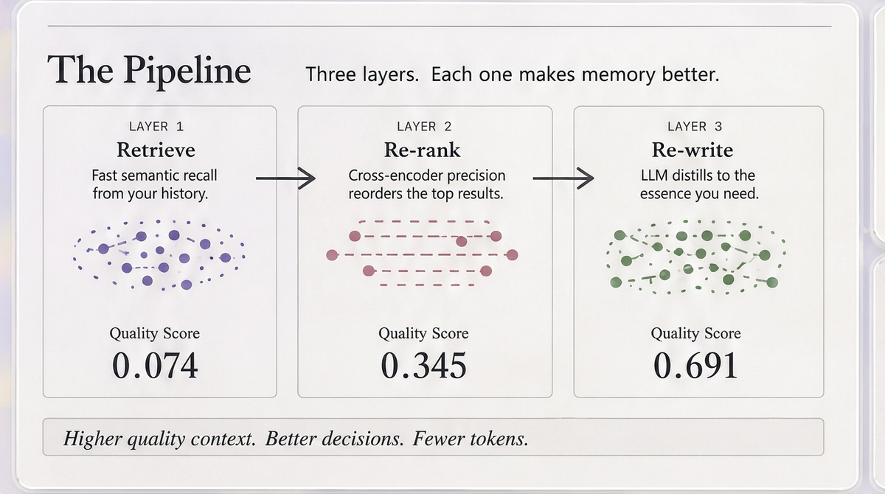

# Claude Self-Reflect

<div align="center">


[](https://www.npmjs.com/package/claude-self-reflect) [](https://www.npmjs.com/package/claude-self-reflect) [](https://opensource.org/licenses/MIT) [](https://github.com/ramakay/claude-self-reflect/releases/latest) [](https://github.com/anthropics/claude-code) [](https://modelcontextprotocol.io/) [](https://github.com/ramakay/claude-self-reflect/tree/main/csr-engine) [](https://github.com/ramakay/claude-self-reflect) [](https://github.com/ramakay/claude-self-reflect/stargazers)

**Claude forgets everything. This fixes that.**

Single 44MB binary. No databases. No containers. No API keys required.

[Install](#install) | [How It Works](#how-it-works) | [MCP Tools](#mcp-tools) | [FAQ](https://ramakay.github.io/claude-self-reflect/#/docs/troubleshooting)

### **[v8.0 — Complete Rust Rewrite →](https://ramakay.github.io/claude-self-reflect/)**



</div>

## Table of Contents

- [The Problem](#the-forgetting-problem) — Why Claude needs memory
- [The Architecture](#one-binary-44mb) — How CSR solves it
- [The Pipeline](#the-pipeline) — Progressive enrichment (9.3x improvement)
- [Install](#install) — One command setup
- [What You'll Ask](#what-youll-ask) — Natural language, no syntax
- [Performance](#performance) | [MCP Tools](#mcp-tools) | [Hooks](#hooks) | [CLI](#cli-reference)
- [AI Narratives](#ai-narratives-optional) | [Upgrading](#upgrading-from-v7x) | [Troubleshooting](#troubleshooting)

---

## The Forgetting Problem

<a href="https://ramakay.github.io/claude-self-reflect/">
<picture>
  <source media="(prefers-color-scheme: dark)" srcset="docs-site/public/images/card-01-hook-dark.png" />
  
</picture>
</a>

Claude starts fresh every session. Solutions you found, architectures you designed, bugs you debugged — all gone.

Context retention drops below **20% after 10 sessions**. CSR fixes this with a single binary that gives Claude perfect memory.

No special syntax. No commands. Install once, and past context appears automatically when you need it.

<br clear="both" />

> **[Explore the full documentation →](https://ramakay.github.io/claude-self-reflect/)**

---

## One Binary. 44MB.

<a href="https://ramakay.github.io/claude-self-reflect/#/docs/architecture">
<picture>
  <source media="(prefers-color-scheme: dark)" srcset="docs-site/public/images/card-02-arch-dark.png" />
  
</picture>
</a>

Everything runs locally in a single process. No Docker, no database server, no API keys required.

- **SQLite** — storage for chunks, embeddings, enrichment state
- **HNSW** — sub-millisecond vector search (<1ms p95)
- **FastEmbed** — 384-dim local embeddings
- **AST** — code-aware search across 6 languages

**6 hooks** fire across the session lifecycle. **12 MCP tools** for explicit search.

<br clear="both" />

> **[Explore the full documentation →](https://ramakay.github.io/claude-self-reflect/#/docs/architecture)**

---

## The Pipeline

<a href="https://ramakay.github.io/claude-self-reflect/#/docs/enrichment">
<picture>
  <source media="(prefers-color-scheme: dark)" srcset="docs-site/public/images/card-03-pipeline-dark.png" />
  
</picture>
</a>

Three layers progressively improve search quality from raw chunks to AI-enriched narratives — **9.3x improvement**.

Higher quality context. Better decisions. Fewer tokens.

<br clear="both" />

> **[Explore the full documentation →](https://ramakay.github.io/claude-self-reflect/#/docs/enrichment)**

---

## Install

```bash
curl -fsSL https://raw.githubusercontent.com/ramakay/claude-self-reflect/main/scripts/install.sh | sh
```

One command. Downloads the binary, runs setup, registers MCP server, installs 6 hooks. Restart Claude Code.

| Platform | Support |
|----------|---------|
| macOS (Apple Silicon) | Prebuilt binary |
| Linux x86_64 / WSL | Prebuilt binary |
| Linux ARM64 | Prebuilt binary |
| macOS (Intel) | Build from source |

<details>
<summary>Alternative: npm</summary>

```bash
npm install -g claude-self-reflect
```

</details>

<details>
<summary>Build from source</summary>

```bash
git clone https://github.com/ramakay/claude-self-reflect.git
cd claude-self-reflect/csr-engine
cargo build --release
cp target/release/csr-engine ~/.local/bin/
csr-engine setup
```

</details>

<details>
<summary><strong>What You'll Ask</strong> — after install, just ask Claude naturally</summary>

- *"How did we solve re-renders on this component?"*
- *"What did we tell Joe about that commit?"*
- *"What were our frustrations with this approach?"*
- *"Where did we put the auth middleware config?"*

No special syntax. No commands. CSR finds relevant past context and injects it automatically.

</details>

<details>
<summary><strong>Performance</strong> — sub-millisecond search, 93ms startup</summary>

| Metric | Value |
|--------|-------|
| **Cached startup** | 93ms |
| **Search latency (p95)** | <1ms |
| **Binary size** | 44MB |
| **Import speed** | ~20 conversations/sec |
| **Embedding** | 0.73ms/text (batch) |

</details>

<details>
<summary><strong>MCP Tools</strong> — 12 tools available to Claude</summary>

| Tool | Description |
|------|-------------|
| `csr_reflect_on_past` | Semantic search across past conversations |
| `store_reflection` | Store insights for future retrieval |
| `csr_quick_check` | Fast existence check (count + top match) |
| `search_by_recency` | Time-constrained search ("last week") |
| `get_recent_work` | "What did we work on?" with session grouping |
| `get_timeline` | Activity timeline with statistics |
| `csr_search_by_file` | Find conversations that touched a file |
| `csr_search_by_concept` | Theme-based search ("security", "testing") |
| `csr_search_insights` | Aggregated patterns from search results |
| `csr_get_more` | Paginate through additional results |
| `get_full_conversation` | Retrieve complete JSONL conversation |
| `get_session_learnings` | Iteration-level memory for Ralph loops |

</details>

<details>
<summary><strong>Hooks</strong> — 6 session lifecycle hooks</summary>

| Hook | What it does |
|------|-------------|
| **SessionStart** | Surfaces relevant past context at conversation start |
| **UserPromptSubmit** | Predicts and injects context before Claude responds |
| **PostToolUse** | Tracks file edits with session-scoped dedup |
| **Stop** | Stores iteration learnings, detects stuck patterns |
| **PreCompact** | Backs up state before context compaction |
| **SessionEnd** | Stores session narrative for future retrieval |

All hooks use catch-all error handling. They never block Claude Code.

</details>

<details>
<summary><strong>AI Narratives</strong> — optional 9.3x quality boost</summary>

Transform raw conversations into rich, searchable narratives. Requires an Anthropic API key.

```bash
csr-engine daemon
```

| Metric | Without | With AI Narratives |
|--------|---------|-------------------|
| Search quality | 0.074 | 0.691 (9.3x) |
| Token compression | 100% | 18% (82% reduction) |
| Cost per conversation | - | ~$0.012 (Batch API) |

</details>

<details>
<summary><strong>CLI Reference</strong></summary>

```
csr-engine                     Start MCP server (default)
csr-engine setup               One-shot setup: import + MCP + hooks
csr-engine status              System status (JSON)
csr-engine status --compact    One-line statusline output
csr-engine daemon              Background enrichment daemon
csr-engine hook install --apply Install Claude Code hooks
csr-engine eval                Quick eval (5 tests)
csr-engine eval --full         Full eval (20 tests)
csr-engine quality <file>      AST-based code quality analysis
```

</details>

<details>
<summary><strong>Upgrading from v7.x</strong></summary>

v8.0 replaces the Python/Docker stack with a single Rust binary.

```bash
docker compose down 2>/dev/null
curl -fsSL https://raw.githubusercontent.com/ramakay/claude-self-reflect/main/scripts/install.sh | sh
```

Your conversation data (`~/.claude/projects/`) is untouched. The new engine re-imports from the same JSONL files.

</details>

<details>
<summary><strong>Troubleshooting</strong></summary>

| Symptom | Fix |
|---------|-----|
| No search results | Run `csr-engine setup` |
| MCP tools not available | Run `csr-engine setup`, restart Claude Code |
| "spawn ENOENT" in MCP | Ensure `csr-engine` is in PATH |
| Slow first startup | Normal (~14s for index rebuild, subsequent: ~93ms) |

Full guide: [Documentation](https://ramakay.github.io/claude-self-reflect/#/docs/troubleshooting)

</details>

<details>
<summary><strong>Uninstall</strong></summary>

```bash
claude mcp remove claude-self-reflect
rm -rf ~/.claude-self-reflect/
rm ~/.local/bin/csr-engine
npm uninstall -g claude-self-reflect  # if installed via npm
```

</details>

<details>
<summary><strong>Contributors (v1–v7)</strong></summary>

- **[@TheGordon](https://github.com/TheGordon)** - Fixed timestamp parsing (#10)
- **[@akamalov](https://github.com/akamalov)** - Ubuntu WSL insights
- **[@kylesnowschwartz](https://github.com/kylesnowschwartz)** - Security review (#6)

</details>

---

[Documentation](https://ramakay.github.io/claude-self-reflect/) | [npm](https://www.npmjs.com/package/claude-self-reflect) | [Issues](https://github.com/ramakay/claude-self-reflect/issues) | MIT License
